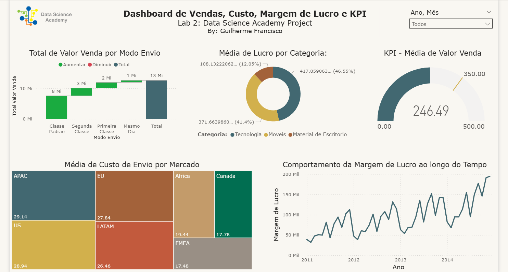

# Sales Analysis Dashboard – Power BI

This interactive dashboard was developed during my Data Science Academy course to explore international sales performance. It uses filters, KPIs, and intuitive visuals to support smarter decision-making.

I enjoy working with raw data and transforming it into clear, useful insights. This project reflects my focus on clean design, structured modeling, and practical analytics.

---

## 📊 Dashboard Preview

  

## 📌 Dashboard Features

- Total sales value by shipping method  
- Dynamic KPI showing average sales value  
- Average shipping cost by market (region)  
- Monthly profit margin trend  
- Interactive filters by year and month  

---

## 📊 Key Metrics

- **Total Sales:** R$ 12.64 million  
- **Total Profit:** R$ 1.47 million  
- **Categories:** Furniture, Technology, Office Supplies  
- **Segments:** Consumer, Corporate, Home Office  
- **Priority Levels:** Critical, High, Medium, Low  

---

## 🧠 What I Learned

During this project, I improved my skills in modeling and formatting data in Power BI. I worked with Unicode text files and organized tables to avoid errors. I created one-to-one and one-to-many relationships, ensured unique IDs, and kept the visuals consistent. I also used M language in Power Query to transform the data and strengthen the integrity between tables.

This project helped me consolidate key concepts in data modeling and preparation, while reinforcing my attention to detail and practical use of Power BI.

---

📁 Project Files
Dashboard_Vendas.pbix – Complete Power BI dashboard with KPIs, filters, and visual insights

images/ – Folder containing a high-resolution preview of the dashboard

Clientes.csv, Pedidos.csv, Produtos.csv, Vendas.csv – Structured datasets used for modeling and analysis

README.md – Project overview, key metrics, and technical learning summary

All files are organized for clarity and impact. This repository showcases both analytical depth and presentation quality.

All files are organized for easy navigation and to highlight both technical execution and presentation quality.
> 🔗 [View the full project on GitHub](https://github.com/GuihJF/Anlise_de_Vendas_PowerBI)

---

